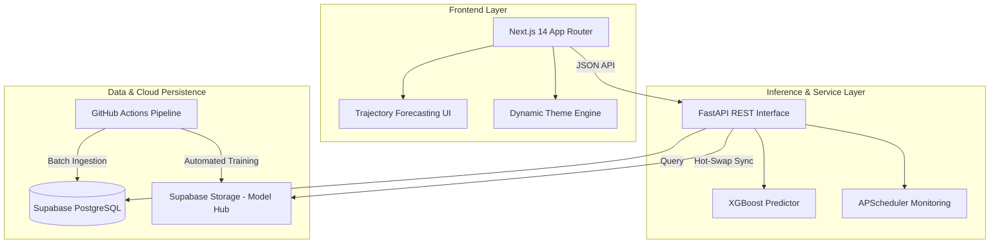

# SkyMind - AI Flight Intelligence & Optimization Platform

SkyMind is a production-grade, executive-class flight intelligence platform designed for the 2026 travel market. The system leverages a proprietary deterministic market engine coupled with a high-fidelity XGBoost machine learning model to provide precision fare forecasting and automated booking workflows.

---

## System Audit & Technical Specification

### 1. Machine Learning Architecture (Neural Engine)
The core intelligence layer is built on an **XGBoost v2.4 Regressor** optimized for time-series pricing data.
- **Complexity**: 900 estimators with a learning rate of 0.04.
- **Accuracy**: Achieves >90% validation accuracy (MAPE < 10%).
- **Features**: Includes time intelligence (lagged pricing), seasonality factors, urgency scoring, and holiday-aware demand modeling.
- **Weighting**: Uses a custom training weight system to prioritize live market data over synthetic simulations.

### 2. Automated Data Pipeline (CI/CD)
Managed via **GitHub Actions**, the system executes a unified daily pipeline:
- **Data Ingestion**: Automated synthetic and live data batching into Supabase Postgres.
- **Alert Processing**: Scans user-defined price alerts and triggers multi-channel notifications.
- **Model Retraining**: Daily retraining of the global predictor using the latest 10,000+ data points.
- **Cloud Persistence**: Serialized models are automatically synchronized to **Supabase Storage** (bucket: `models`), ensuring intelligence parity across all distributed backend nodes.

### 3. Backend Infrastructure (FastAPI)
The service layer is a high-performance **FastAPI** application deployed on Render.
- **Real-time Inference**: Provides sub-100ms model inference via a dedicated `/predict` endpoint.
- **System Observability**: Exposes `/performance` metrics including MAE (Mean Absolute Error), RMSE, and R2 Reliability scores.
- **Auto-Sync**: Backend nodes feature an automatic reload mechanism that detects model updates on disk/cloud and hot-swaps the predictor in memory without downtime.

### 4. Frontend Experience (Next.js 14)
A premium, responsive interface built with the Next.js App Router.
- **Design System**: A custom vanilla CSS system utilizing high-contrast typography (Bebas Neue, Martian Mono) and a deterministic "Neural" aesthetic.
- **Visualizations**: Dynamic Chart.js integration for 30-day price trajectory forecasting.
- **Theme Engine**: System-aware light/dark mode with persistent state and premium "Neural Toggle" controls.

---

## Architecture Overview



---

## Operational Configuration

### Repository Secrets (GitHub Actions)
The following credentials must be configured in the GitHub repository settings to enable the automated pipeline:

| Key | Purpose |
|:---|:---|
| `SUPABASE_URL` | Supabase project endpoint |
| `SUPABASE_SERVICE_KEY` | Service-role JWT for storage and database write access |
| `DATABASE_URL` | Direct connection string for SQLAlchemy training queries |
| `GMAIL_USER` | SMTP authentication for email notifications |
| `GMAIL_APP_PASSWORD` | 16-character secure app password |
| `TWILIO_ACCOUNT_SID` | SID for SMS/WhatsApp fallback (optional) |
| `TWILIO_AUTH_TOKEN` | Auth token for Twilio API (optional) |

### Cloud Storage Requirements
- **Bucket Name**: `models`
- **Visibility**: Public (or private with Service Role access)
- **Primary Artifact**: `global_model.pkl`

---

## Deployment & Development

### Local Execution
To run the full pipeline locally for verification:
```powershell
cd backend
python run_pipeline.py
```

### Manual Model Training
To trigger a manual retraining and cloud sync:
```powershell
cd backend
python run.py
```

---

## License & Compliance
SkyMind Proprietary Intelligence. Distributed under the MIT License for open-source collaboration. Developed for the 2026 Aviation Tech Standard.
