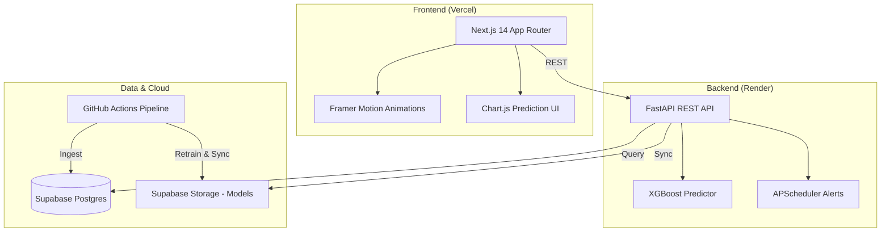

# ✈️ SkyMind — AI Flight Intelligence & Optimization

SkyMind is a production-grade, executive-class flight intelligence platform. It combines a proprietary deterministic flight engine with a **900-estimator XGBoost ML model** to predict fare trajectories with over 90% accuracy.

---

## 🧠 Core Intelligence
SkyMind doesn't just search; it *anticipates*.

| Module | Technology | Outcome |
|:---|:---|:---|
| **Price Prediction** | **XGBoost v2.4** | Forecasts 30-day price trajectories with confidence intervals. |
| **Market Engine** | **Deterministic Simulation** | Generates market-realistic fares based on demand, seasonality, and airline positioning. |
| **Automation** | **GitHub Actions** | Daily automated data ingestion, alert checking, and model retraining. |
| **Persistence** | **Supabase Storage** | Cloud-synced ML models ensure intelligence parity across all deployments. |

---

## 🏗️ Architecture (2026 Production)



---

## 📦 Tech Stack

### Frontend
- **Framework**: Next.js 14 (App Router)
- **Styling**: Vanilla CSS (Premium "Clean White" System)
- **State/Data**: TanStack Query (React Query)
- **Visuals**: Framer Motion + Lucide Icons + Chart.js

### Backend
- **Framework**: FastAPI (Python 3.10+)
- **Database**: Supabase (PostgreSQL) + SQLAlchemy ORM
- **Automation**: GitHub Actions (Daily Cron)
- **Payments**: Razorpay Integration
- **Notifications**: Gmail SMTP + Twilio (SMS/WhatsApp)

### AI / ML
- **Model**: XGBoost Regressor (900 estimators)
- **Training**: Automated daily pipeline via GitHub Actions
- **Persistence**: Models serialized to Supabase Storage

---

## 🚀 Deployment & Secrets

### 1. GitHub Secrets
For the daily retraining pipeline to work, the following secrets must be added to your GitHub repository:
- `SUPABASE_URL` & `SUPABASE_SERVICE_KEY`
- `GMAIL_USER` & `GMAIL_APP_PASSWORD` (For alerts)
- `TWILIO_ACCOUNT_SID` & `TWILIO_AUTH_TOKEN` (Optional)

### 2. Supabase Storage
- Create a **Public** bucket named `models` in Supabase. This stores the `global_model.pkl` trained by GitHub.

---

## 📁 Project Structure
```text
flight-ai-platform/
├── .github/workflows/    # GitHub Actions (Daily Pipeline)
├── frontend/
│   ├── app/              # Next.js Pages
│   ├── components/       # UI & Flight Components
│   └── lib/              # API & Client Logic
├── backend/
│   ├── ml/               # XGBoost Models & Logic
│   ├── database/         # Supabase & SQL Logic
│   ├── services/         # Flight Engine & Notifications
│   └── run_pipeline.py   # Unified GitHub Pipeline
└── DEPLOYMENT.md         # Detailed Ops Guide
```

---

## 📜 License
SkyMind Proprietary Intelligence © 2026. Distributed under MIT License.
