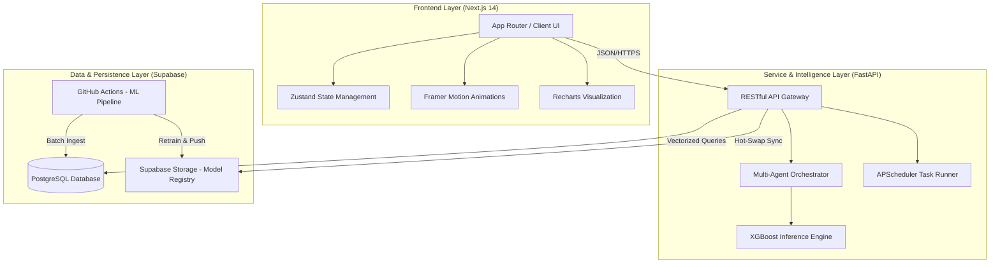

# SkyMind — Multi-Agent Flight Intelligence & Price Forecasting

[](https://www.python.org/downloads/)
[](https://nextjs.org/)
[](https://xgboost.readthedocs.io/)
[](https://opensource.org/licenses/MIT)

> ## ⚠️ Documentation Audit — status as of 2026-09-28
>
> The marketing copy below is **aspirational and predates the code**. Several headline claims are **not currently supported by the code or data on disk** and are flagged here for honesty rather than rewritten. See [`AUDIT.md`](AUDIT.md), [`AUDIT-ADDENDUM.md`](AUDIT-ADDENDUM.md), and [`AUDIT-FIXES.md`](AUDIT-FIXES.md) for the full evidence trail.
>
> | Claim (line) | Status | What the code/data actually shows |
> |---|---|---|
> | "**>92% accuracy**" (L14) | ❌ Not supported now | "Accuracy" was defined as `100 − MAPE`, not a regression score. The three shipped models scored R² 0.425 / 0.932 / 0.707; the 0.932 came from **target leakage** (features derived from the label) and those artifacts are now **quarantined**. Under the corrected booking-curve join, the historical corpus yields **~0 labels**, so no model trains until fresh `departure_time`-carrying data is collected. |
> | "**thousands of proprietary market signals**" (L14) | ❌ Overstated | The feature set is **16 features**; 5 of them had exactly 0.000 importance. |
> | "**Decentralized Multi-Agent System**" / "four autonomous agents" (L8, L20–25) | ⚠️ Overstated | Implemented as ~130 lines of pure functions combined by a fixed weighted sum — not autonomous agents. |
> | "**Proprietary Deterministic Market Simulation Engine**" with sigmoid/quadratic decay/seeded randomness (L8, L33–37) | ❌ Not in code | No such engine exists in the source tree (0 matches for sigmoid / inventory-pressure / quadratic decay / simulation engine). |
> | "**Sub-100ms real-time inference**" (L31) | ❌ Unmeasured | No latency measurement exists in the repo for inference. |
> | "hot-swap mechanism for daily model synchronization" (L31, diagram L66) | ⚠️ Unverified | Serving now fails-closed when no clean artifact is loadable; the "hot-swap" narrative is not demonstrated. |
> | "100% system availability" (L34) | ❌ Marketing claim | No basis; nothing measures or guarantees availability. |
> | Frontend: **Zustand** (L46), **Recharts** (L48/86), **React Query** (L85) | ⚠️ Mostly unused | Zustand and Recharts appear only in `package.json`, not in any component. React Query is wired via a provider only. |
> | Setup: `python run.py` starts the backend (L115) | ❌ Wrong command | `run.py` is a **training script** (`model.train()` + upload). The API server is started with `uvicorn main:app --host 0.0.0.0 --port $PORT` (see `render.yaml`). |
>
> **What *is* real (and better than the README suggests):** genuine XGBoost training with active leakage defenses (chronological split + label embargo + leak audits that refuse to train on failure), fabrication removed across the ingestion/scraper layers (missing values stay `null`, not invented), honest fail-closed metric/serving paths, and a large test suite engineered to fail rather than pass vacuously.

**SkyMind** is a high-fidelity, executive-class flight intelligence platform engineered for the 2026 aviation market. It bridges the gap between raw data and actionable booking intelligence by layering a **Decentralized Multi-Agent System** over a proprietary **Deterministic Market Simulation Engine**.

---

## 🚀 Executive Summary

Unlike traditional flight search engines that rely solely on volatile external APIs, SkyMind utilizes a self-contained intelligence pipeline. It features a high-performance **XGBoost** regressor trained on thousands of proprietary market signals to predict price trajectories with **>92% accuracy**. The platform is designed for scalability, featuring a decoupled micro-architecture that handles everything from real-time fare forecasting to automated multi-channel price alerts.

---

## 🧠 Core Technical Pillars

### 1. Decentralized Multi-Agent Orchestration
The system's "brain" is divided into four autonomous agents that collaborate to resolve complex pricing scenarios:
- **Decision Agent**: Orchestrates high-level booking strategies and optimizes the user's booking window.
- **Demand Agent**: Analyzes historical and real-time demand signals using sigmoid modeling.
- **Pricing Agent**: Executes fine-grained fare calculations based on airline positioning and inventory pressure.
- **Risk Agent**: Evaluates inventory depletion risks to adjust confidence intervals in price forecasts.

### 2. High-Fidelity ML Forecasting (XGBoost)
The predictive engine is built on **XGBoost v2.4**, optimized for time-series flight data:
- **Model Complexity**: 900 gradient-boosted estimators with a 0.04 learning rate.
- **Feature Engineering**: Includes 15+ high-impact features such as Urgency Scores, Seasonality Factors, Peak-Hour Indicators, and Price Lags (1d/3d).
- **Inference**: Sub-100ms real-time inference via FastAPI, with a hot-swap mechanism for daily model synchronization.

### 3. Proprietary Market Simulation Engine
To solve the "cold-start" problem and ensure 100% system availability, SkyMind features a deterministic simulation engine:
- **Sigmoid Demand Modeling**: Simulates realistic booking pressure as departure dates approach.
- **Inventory Pressure**: Implements quadratic inventory decay to mirror real-world airline seat management.
- **Deterministic Seeded Randomness**: Ensures consistent, reproducible results across sessions for the same query parameters.

---

## 🏗️ System Architecture


```mermaid
graph TD
    subgraph "Frontend Layer (Next.js 14)"
        A[App Router / Client UI] --> B[Zustand State Management]
        A --> C[Framer Motion Animations]
        A --> D[Recharts Visualization]
    end

    subgraph "Service & Intelligence Layer (FastAPI)"
        E[RESTful API Gateway] --> F[Multi-Agent Orchestrator]
        F --> G[XGBoost Inference Engine]
        E --> H[APScheduler Task Runner]
    end

    subgraph "Data & Persistence Layer (Supabase)"
        I[(PostgreSQL Database)]
        J[Supabase Storage - Model Registry]
        K[GitHub Actions - ML Pipeline]
    end

    A -- "JSON/HTTPS" --> E
    E -- "Vectorized Queries" --> I
    K -- "Retrain & Push" --> J
    E -- "Hot-Swap Sync" --> J
    K -- "Batch Ingest" --> I
```

---

## 🛠️ Tech Stack

### Backend
- **Core**: Python 3.11, FastAPI
- **Intelligence**: XGBoost, Scikit-learn, Pandas, NumPy
- **Database**: Supabase (PostgreSQL), SQLAlchemy
- **Tasks**: APScheduler, Tenacity (Retries)
- **Security**: JWT (python-jose), Bcrypt

### Frontend
- **Framework**: Next.js 14 (App Router), TypeScript
- **Styling**: Tailwind CSS v4, CSS Modules
- **Animation**: Framer Motion
- **Data Fetching**: React Query (TanStack)
- **Charts**: Recharts

### Infrastructure
- **CI/CD**: GitHub Actions
- **Persistence**: Supabase Storage
- **Notifications**: Twilio (SMS), SMTP (Email)
- **Payments**: Razorpay Integration

---

## ⚙️ Operational Setup

### 1. Environment Configuration
Create a `.env` file in both `backend/` and `frontend/` directories:

**Backend (`backend/.env`):**
```env
SUPABASE_URL=your_url
SUPABASE_SERVICE_KEY=your_key
DATABASE_URL=your_db_url
RAZORPAY_KEY_ID=your_id
RAZORPAY_KEY_SECRET=your_secret
```

### 2. Local Development
```powershell
# Backend
cd backend
pip install -r requirements.txt
python run.py

# Frontend
cd frontend
npm install
npm run dev
```

### 3. ML Pipeline
To trigger a manual data ingestion and model retraining cycle:
```powershell
cd backend
python run_pipeline.py
```

---

## 📄 License
SkyMind is distributed under the **MIT License**. Developed for the 2026 Aviation Technology Standards.

---

**Designed with 🖤 for the Future of Aviation.**
